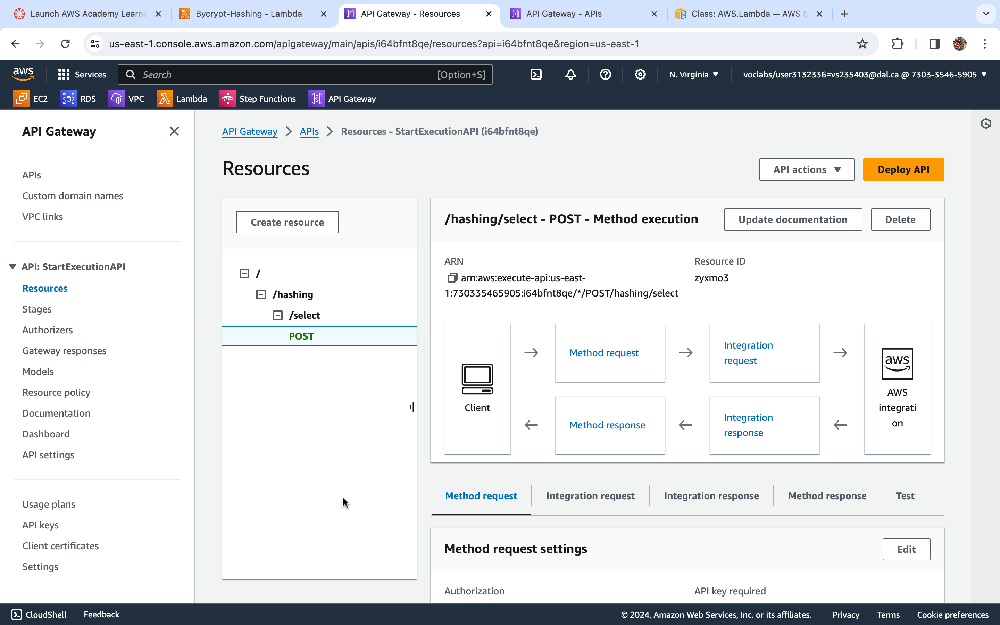
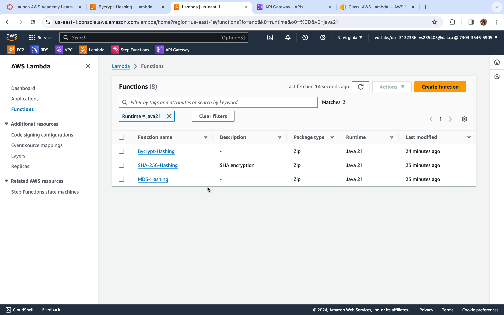
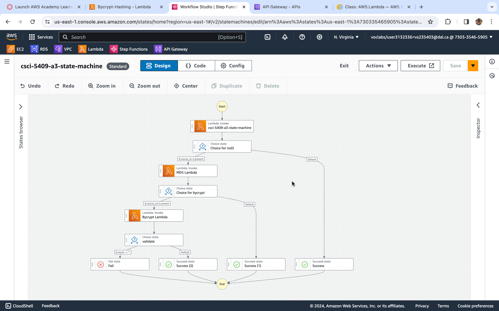

# Problem Statement
Build REST API entry points using serverless compute mechanisms. In this mechanism, you will create a State Machine, configured with API gateway, which will evaluate a choice
based on an input, and based on this choice, you will invoke a Lambda function, which will perform a hashing operation on a provided input data.

## Endpoint for state machine - /hashing/select
Input JSON:  
{  
"input": "{  
&emsp;"course_uri": "<URL of My App API>/serverless/end",  
&emsp;"action": "sha256 or md5 or bcrypt",  
&emsp;"value": "\<data to perform hash operation on>"  
&emsp;}",  
"name": "ScriptExecution",  
"stateMachineArn": "<State Machine ARN that you sent>"  
}  

This JSON will call the API gateway which is configured to trigger the state machine to invoke the respective lambda function.

## SHA-256
If action is sha256, then the lambda function which performs the SHA-256 hashing is called.  
Output JSON:  
{    
"result": "<hashed value>",  
"arn": "<ARN of your SHA-256 Lambda function >",  
"action": "sha256",  
"value": "<data to perform hash operation on>"  
}

## MD5
If action is md5, then the step function fails at step 1 and then moves on to step 2 where the lambda function which performs the MD5 hashing is called.  
Output JSON:  
{  
"result": "<hashed value>",  
"arn": "<ARN of your MD5 Lambda function>",  
"action": "md5",  
"value": "<data to perform hash operation on>"  
}

## Bycrypt
If action is bcrypt, then the step function fails at step 1 and step 2, then moves on to step 3 where the lambda function which performs the bycrypt hashing is called.  
Output JSON:  
{  
"result": "<hashed value>",  
"arn": "<ARN of your bcrypt Lambda function >",  
"action": "bcrypt",  
"value": "<data to perform hash operation on>"  
}

## AWS Configuration Screenshots
### Amazon API Gateway

### AWS Lambda

### State Machine with Step Functions

